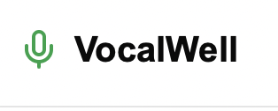
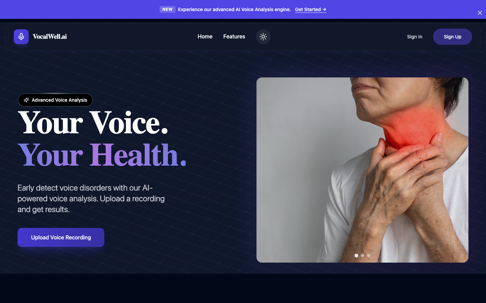
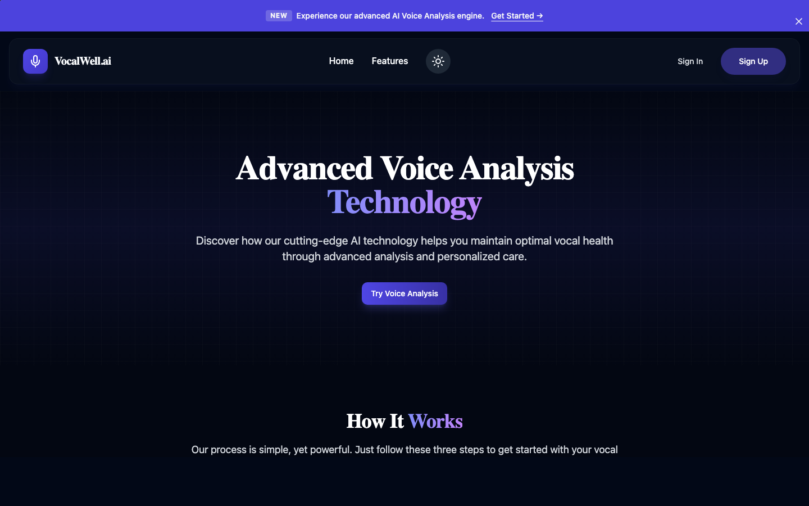
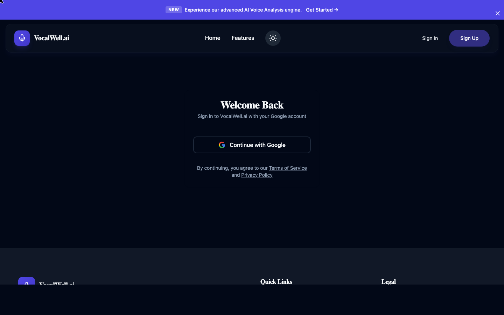
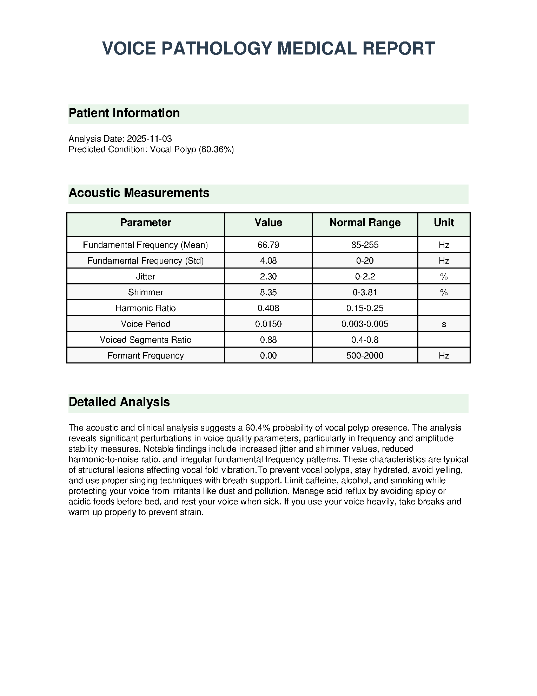
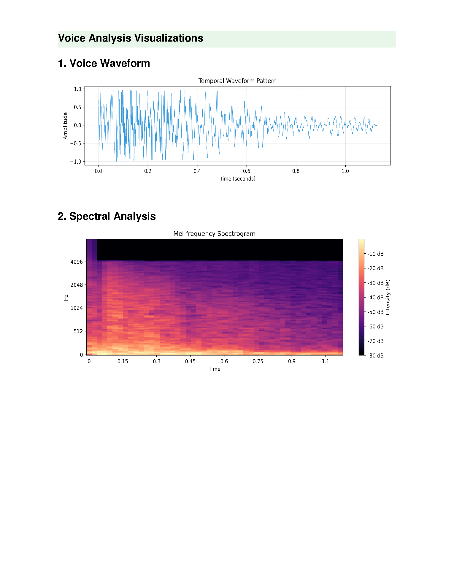
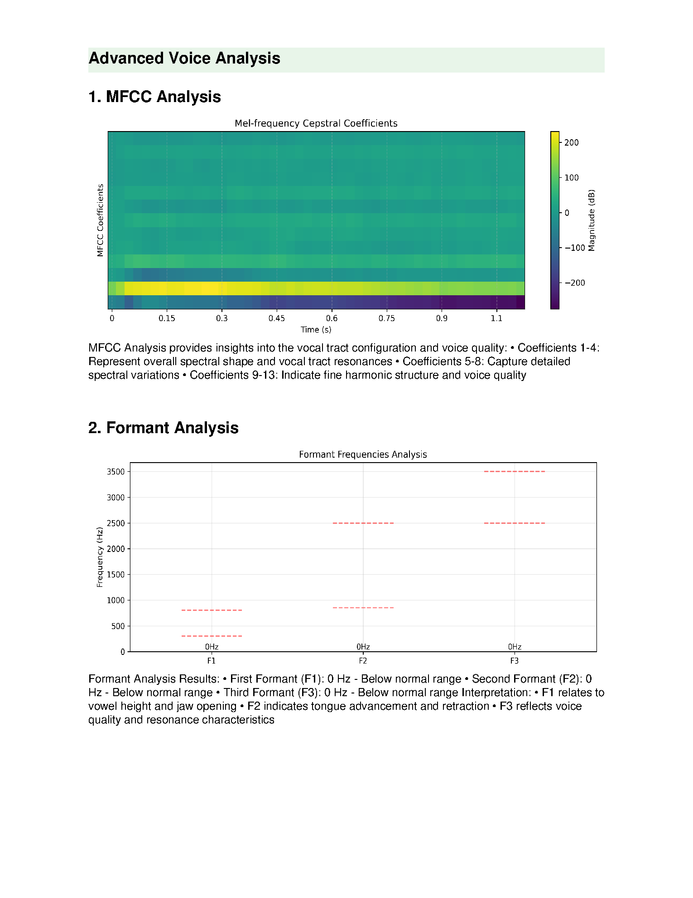

<div align="center">



# VocalWell.ai — Frontend

**AI-powered voice health platform with blockchain-verified reporting**

[](https://nextjs.org)
[](https://typescriptlang.org)
[](https://tailwindcss.com)
[](https://supabase.com)
[](https://vocalwell.vercel.app)
[](LICENSE)

> Record your voice, get an AI diagnosis, track your vocal health — secured on-chain.

**[Live App](https://vocalwell.vercel.app)** · [Backend](https://github.com/auraCodesKM/vocalB) · [Deployment Guide](DEPLOYMENT.md)

</div>

---

## Overview

VocalWell.ai is a full-stack voice health SaaS platform. The frontend is a Next.js 14 application that lets users record or upload voice samples, receive AI-powered pathology analysis from the backend, visualize their vocal health history, complete guided exercises, connect with doctors, and store tamper-proof reports on IPFS with on-chain verification via EduChain.

### Live App Screenshots



<table>
<tr>
<td align="center" width="50%">

<br/><sub>Advanced Voice Analysis Technology page</sub>
</td>
<td align="center" width="50%">

<br/><sub>Google OAuth Sign In</sub>
</td>
</tr>
</table>

---

## Features

### Voice Analysis
- Record voice directly in-browser (up to 30 seconds) or upload a WAV file
- 5 standardized vocal phrases for consistent pattern detection
- Real-time multi-step loading with analysis progress states
- Results display: predicted condition, risk level, and confidence plot
- Full 3-page clinical PDF report (download or view inline)

### Dashboard & Analytics
- Analysis history with risk level indicators
- Vocal health statistics — healthy vs. issue counts
- 6-month trend charts with Recharts
- Risk distribution visualization across sessions
- Recent exercise activity summary

### Vocal Exercise Tracker
- 8 guided exercises: Lip Trills, Humming Scales, Vocal Sirens, Straw Phonation, and more
- Difficulty tiers: Beginner, Intermediate, Advanced
- Per-exercise duration (2–5 minutes)
- Daily streak tracking — current streak and longest streak
- Exercise completion history with timestamps
- Progress percentage across the full exercise library
- Persisted in localStorage per user

### Blockchain Reports
- PDF reports uploaded to IPFS via Pinata
- Report hash stored on EduChain Testnet smart contract
- MetaMask wallet connect for on-chain verification
- SHA-256 integrity check on every report
- Contract: `0x7d115f7b72CccB0e741AB44919B376c1689e7f91`

### Resource Hub
- Blockchain-based resource marketplace
- Buy and sell voice health resources using ETH
- Smart contract interaction via ethers.js v6
- ETH balance display and wallet management

### Doctor Connect
- Map-based specialist finder (Leaflet + React Leaflet)
- Geographic display of nearby vocal health professionals
- Direct connect flow

### AI Assistant
- Multiple chatbot interfaces (Voiceflow + custom)
- Personalized vocal health recommendations
- Conversation history persistence

### Auth & Identity
- Google OAuth via Supabase
- Password reset flow
- Session persistence with SSR support
- Protected routes with automatic redirect

---

## Tech Stack

| Category | Technology |
|---|---|
| **Framework** | Next.js 14.2 (App Router) + TypeScript 5 |
| **Styling** | Tailwind CSS 3.4, Radix UI, Framer Motion 12 |
| **Auth & DB** | Supabase (Auth + PostgreSQL + Storage) |
| **Blockchain** | Ethers.js v6, EduChain Testnet, MetaMask |
| **Decentralized Storage** | Pinata (IPFS) |
| **Forms** | React Hook Form v7 + Zod validation |
| **Charts** | Recharts 2.15 |
| **Maps** | Leaflet 1.9 + React Leaflet 4.2 |
| **Icons** | Lucide React 0.454 |
| **Notifications** | Sonner 1.7 |
| **i18n** | i18next 24.2 |
| **Deployment** | Vercel |

---

## Routes

### Public

| Route | Description |
|---|---|
| `/` | Homepage — hero video, features carousel, testimonials |
| `/signin` | Sign in with Google |
| `/signup` | Sign up with Google |
| `/features` | Feature overview page |
| `/terms` | Terms of service |
| `/auth/callback` | OAuth redirect handler |

### Protected (requires auth)

| Route | Description |
|---|---|
| `/dashboard` | Main dashboard — stats, charts, history |
| `/dashboard/exercises` | Vocal exercise tracker with streaks |
| `/dashboard/doctor-connect` | Map-based doctor finder |
| `/dashboard/ai-chatbot` | AI assistant with conversation history |
| `/dashboard/recommendations` | Personalized AI recommendations |
| `/analysis` | Voice recording + upload + analysis results |
| `/profile` | User profile and account management |
| `/profile/reports` | Past analysis report history |
| `/resource-hub` | Blockchain resource marketplace |
| `/report-verification` | On-chain report verification |

---

## Getting Started

### Prerequisites

- Node.js 18+
- A Supabase project (free tier works)
- Backend running locally or deployed ([vocalB](https://github.com/auraCodesKM/vocalB))

### Installation

```bash
git clone https://github.com/auraCodesKM/VocalF.git
cd VocalF
npm install
```

### Environment Variables

Create `.env.local`:

```env
# Supabase (required)
NEXT_PUBLIC_SUPABASE_URL=https://your-project.supabase.co
NEXT_PUBLIC_SUPABASE_ANON_KEY=your_anon_key

# Backend API (required)
NEXT_PUBLIC_API_BASE_URL=http://localhost:7860

# IPFS via Pinata (for blockchain report storage)
NEXT_PUBLIC_PINATA_JWT=your_pinata_jwt

# EduChain smart contract (optional — defaults to deployed contract)
NEXT_PUBLIC_CONTRACT_ADDRESS=0x7d115f7b72CccB0e741AB44919B376c1689e7f91
```

### Run Locally

```bash
npm run dev
# → http://localhost:3000
```

### Build

```bash
npm run build
npm run start
```

---

## Supabase Setup

1. Create a new Supabase project
2. Enable Google OAuth under **Authentication → Providers**
3. Add your Supabase URL and anon key to `.env.local`
4. Set the redirect URL in Google OAuth to: `https://your-domain.com/auth/callback`

The app uses Supabase for:
- User authentication (Google OAuth)
- Session management (SSR-compatible)
- File storage for analysis results

---

## Deployment

### Vercel (Recommended)

```bash
npx vercel --prod
```

Set the environment variables in the Vercel dashboard under **Settings → Environment Variables**. The `vercel.json` at the project root handles routing configuration.

See [VERCEL_DEPLOYMENT.md](VERCEL_DEPLOYMENT.md) for the full step-by-step guide.

---

## Project Structure

```
VocalF/
├── app/                          # Next.js App Router
│   ├── page.tsx                  # Homepage
│   ├── layout.tsx                # Root layout (global navbar, theme)
│   ├── analysis/                 # Voice recording + analysis
│   ├── dashboard/
│   │   ├── page.tsx              # Dashboard (stats, charts, history)
│   │   ├── exercises/            # Exercise tracker
│   │   ├── doctor-connect/       # Map + specialist finder
│   │   ├── ai-chatbot/           # AI assistant
│   │   └── recommendations/      # Personalized recommendations
│   ├── profile/
│   │   ├── page.tsx              # User profile + account settings
│   │   └── reports/              # Analysis report history
│   ├── resource-hub/             # Blockchain marketplace
│   ├── report-verification/      # On-chain report verification
│   ├── signin/ signup/           # Auth pages
│   └── auth/ auth-callback/      # OAuth callback handlers
│
├── components/
│   ├── layout.tsx                # Navbar (scroll effects, theme, mobile menu)
│   ├── dashboard-sidebar.tsx     # Dashboard navigation
│   ├── protected-route.tsx       # Auth guard wrapper
│   ├── ReportVerification.tsx    # Blockchain verification UI
│   ├── chatbots.tsx              # Chatbot integration
│   └── ui/                       # 60+ reusable Radix + Tailwind components
│
├── lib/
│   ├── blockchain.ts             # Ethers.js + EduChain integration
│   ├── contractUtils.ts          # Smart contract helpers
│   ├── config.ts                 # App configuration
│   └── contexts/
│       ├── AuthContext.tsx        # Auth state provider
│       └── ExercisesContext.tsx   # Exercise tracking context
│
├── public/                       # Static assets (logo, images, videos)
├── screenshots/                  # README screenshots
├── reports/                      # Project reports and documentation
├── supabase/                     # Supabase configuration
├── styles/                       # Global CSS
├── DEPLOYMENT.md                 # Deployment guide
└── VERCEL_DEPLOYMENT.md          # Vercel-specific deployment guide
```

---

## Reports

The `reports/` directory contains project documentation and a sample clinical voice analysis report generated by the backend AI engine.

### Sample Clinical PDF Report

A real report generated by the VocalWell.ai AI system — Vocal Polyp case, 60.36% confidence (2025-11-03):

**Page 1 — Patient Info, Acoustic Measurements & Detailed Analysis**



> Full acoustic parameter table: F0 Mean at 66.79 Hz (below 85–255 Hz range), Jitter at 2.30% (above 2.2% threshold), Shimmer at 8.35% (above 3.81%) — indicators consistent with vocal fold structural pathology. Each parameter is measured against clinical normal ranges.

---

**Page 2 — Voice Waveform & Mel-frequency Spectrogram**



> Time-domain waveform showing amplitude irregularities. Mel-frequency spectrogram visualizing frequency energy distribution over time — reduced harmonic structure visible in upper frequency bands.

---

**Page 3 — MFCC Analysis & Formant Frequencies**



> 13-coefficient MFCC heatmap (spectral envelope over time) with interpretation guide. Formant frequency bar chart (F1, F2, F3) with clinical normal-range overlays.

---

Full project documentation: [`reports/PROJECT_REPORT.md`](reports/PROJECT_REPORT.md)
Backend reports and all 56 sample analyses: [auraCodesKM/vocalB](https://github.com/auraCodesKM/vocalB)

---

## Architecture

```
                        ┌─────────────────────┐
                        │   Next.js Frontend   │
                        │   (Vercel Deploy)    │
                        └────────┬────────────┘
                                 │
              ┌──────────────────┼──────────────────┐
              │                  │                  │
              ▼                  ▼                  ▼
    ┌──────────────┐   ┌──────────────────┐  ┌───────────────┐
    │   Supabase   │   │  Flask Backend   │  │  EduChain     │
    │   Auth + DB  │   │  (HF Spaces)     │  │  Testnet      │
    │   + Storage  │   │  Voice Analysis  │  │  Smart        │
    └──────────────┘   └──────────┬───────┘  │  Contract     │
                                  │          └───────┬───────┘
                                  ▼                  │
                         ┌────────────────┐          ▼
                         │  ML Model      │  ┌───────────────┐
                         │  (lsm_model3)  │  │  Pinata IPFS  │
                         │  TensorFlow    │  │  Report Store │
                         └────────────────┘  └───────────────┘
```

---

## Related

**Backend** — [auraCodesKM/vocalB](https://github.com/auraCodesKM/vocalB)
Python/Flask REST API with TensorFlow voice pathology model, clinical PDF generation, and Gunicorn deployment.

---

<div align="center">

Built for vocal health — VocalWell.ai

</div>
